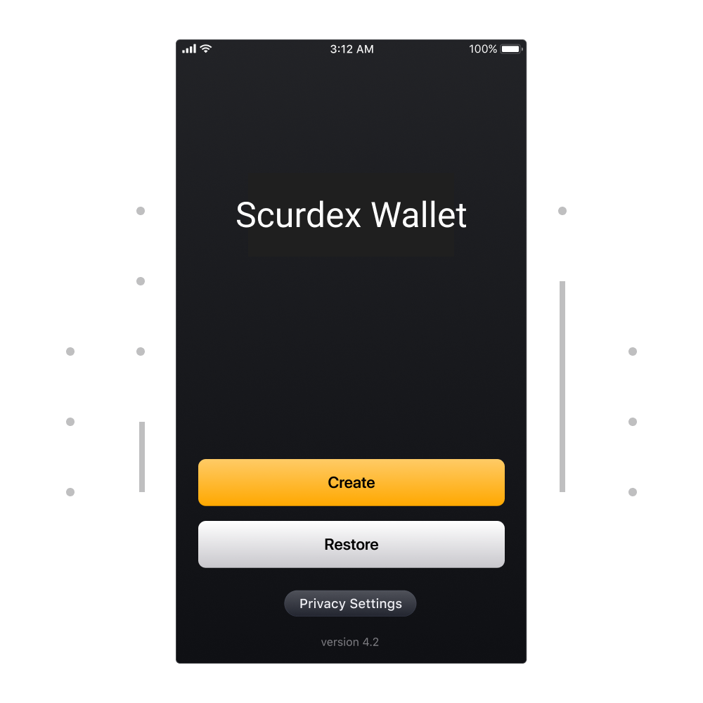
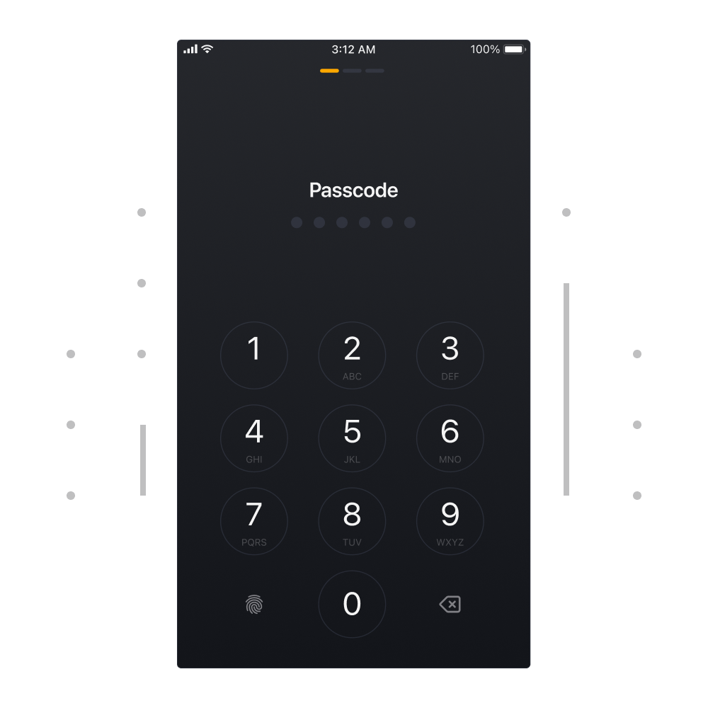
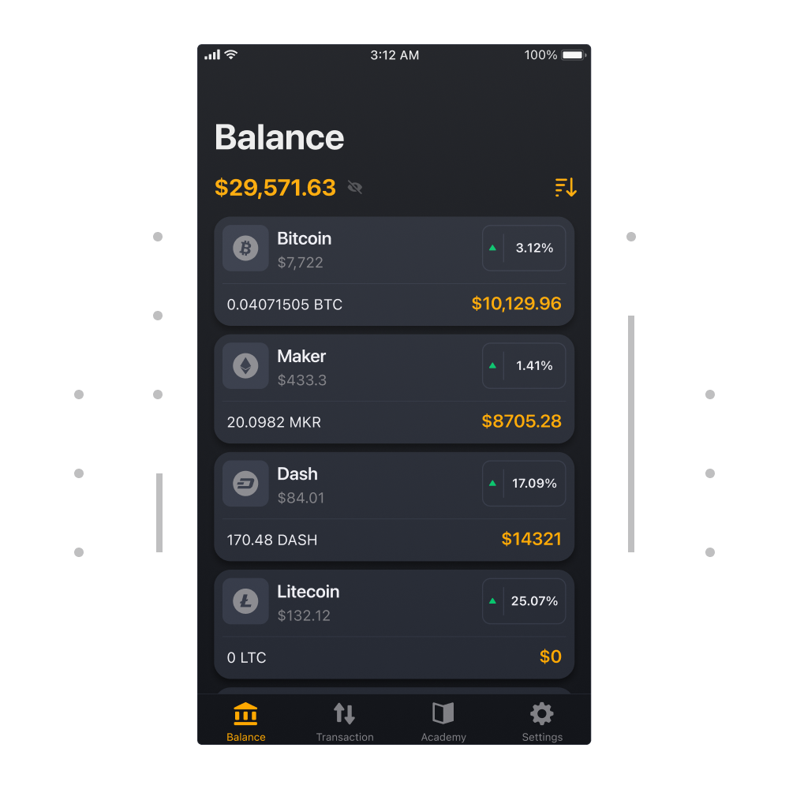
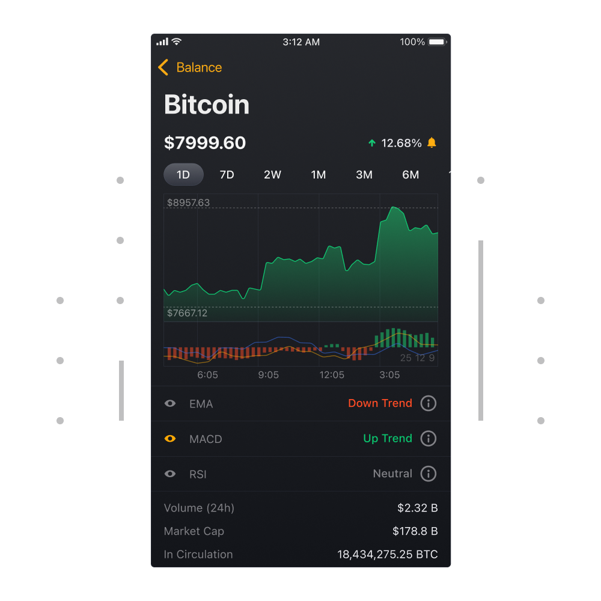
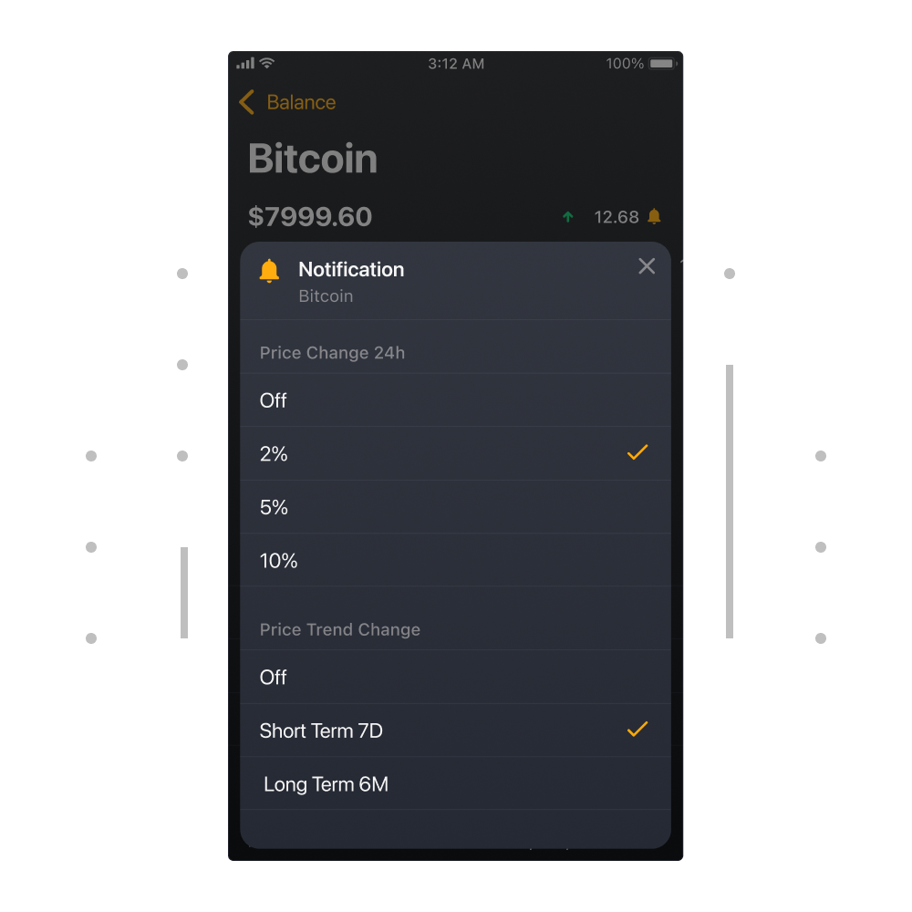
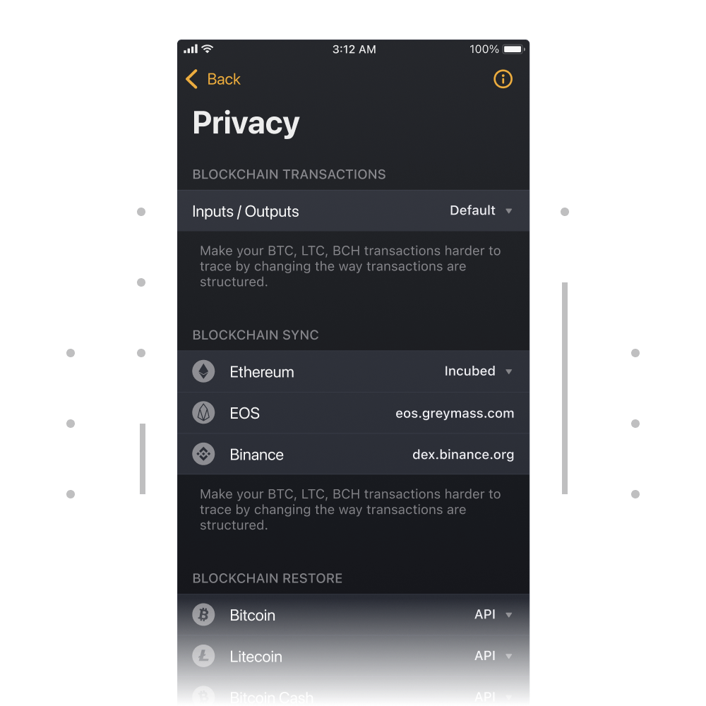

# Scurdex Wallet

In diesem Abschnitt konzentrieren wir uns auf praktische Aspekte und gehen auf „Wissenswertes“ bei der Verwendung von Non-Custodial Wallet-Apps ein.

Aus der Sicht der Nutzer sollten die grundlegenden Erwartungen an jede Non-Custodial Wallet-App sein:

1. die Wallet-App sollte Private Keys auf normgerechte Weise erzeugen. Dadurch wird sichergestellt, dass Private Keys sicher und mit anderen Wallet-Apps von Drittanbietern kompatibel sind.
2. die Wallet-App, die mehrere Kryptowährungen unterstützt, sollte die Zahlungsadressen für jede Kryptowährung korrekt verwalten. Beispielsweise unterscheidet sich die Adresse des Nutzers für den Empfang von Zahlungen in Bitcoin von der Adresse für den Empfang von Ethereum.
3. die Wallet-App sollte Private Keys gemäß den dokumentierten Richtlinien aufbewahren. Sowohl die iOS- als auch die Android-Wallet-Apps sollten sichere vom Betriebssystem bereitgestellte Speichermechanismen nutzen, um den Private Key sicher aufzubewahren.

Abgesehen von den oben genannten „Must-Haves“ kann es je nach Zielgruppe andere Erwartungen an das Wallet geben. Wer eine umfassende Privatsphäre wünscht, benötigt möglicherweise zusätzliche private Funktionen, die in den meisten Wallet-Apps nicht verfügbar sind.

> **Disclaimer: Das [Scurdex Wallet](https://scurdex.com) wurde von [Nichie Systems](https://nichie.io), hergestellt, dem Unternehmen hinter diesen Leitfäden.**

Im Folgenden gehen wir auf einige wichtige Punkte ein, die bei der Verwendung von Non-Custodial Wallet-Apps zu beachten sind. Wir werden die Scurdex Wallet-App verwenden, um diese wichtigen Aspekte zu veranschaulichen.

### 1. Einrichten / Wiederherstellen 

Jede Non-Custodial Wallet beginnt entweder mit dem Prozess der Einrichtung eines Wallets oder der Migration des bestehenden Wallets.

- Die Schaltfläche „Wallet erstellen“ generiert einen neuen Private Key und zeigt diesen in einer Form von 12 Wörtern an, die gespeichert werden müssen.
- Die Option „Wallet wiederherstellen“ stellt ein existierendes Wallet wieder her, das früher in Scurdex oder einem anderen standardkonformen Wallet erstellt worden sein könnte.
	
Denken Sie daran, dass die Wiederherstellung von Custodial Wallets zwischen einigen Minuten bis zu einigen Stunden dauern kann.

### 2. Berechtigungssperre

Es ist wichtig, dass jede Non-Custodial Wallet-App mit integrierten Maßnahmen für unbefugten Zugriff ausgestattet ist. Sowohl Mobile Wallets als auch Hardware Wallets implementieren dies in Form eines Freischaltcodes, der für den Zugriff auf das Wallet erforderlich ist.

Diese Maßnahme ist unerlässlich, um Ihre Gelder auch dann sicher aufzubewahren, wenn eine nicht autorisierte Person an Ihr Wallet-Gerät gelangt.

### 3. Unterstützte Kryptowährungen
       
Je mehr Währungen das Wallet verarbeiten kann, desto besser. Es ist eine Frage der Bequemlichkeit, mit einer App zu interagieren, anstatt zwischen vielen Apps für verschiedene Kryptowährungen zu wechseln.

Die Wallet-App muss auch Zugriff auf die aktuellen Preise der Kryptowährung haben, um Ihre Kryptowährung-Salden in einer Ihnen vertrauten Währung wie USD oder EUR anzuzeigen.

Außerdem sind aktuelle Preise für das Senden von Zahlungen erforderlich. Jemandem Bitcoin im Wert von 90 USD zu senden, ist nicht einfach, wenn man die Rechnung in Gedanken zu machen versucht.

### 4. Überblick über Coins

Jede Kryptowährung ist im Wesentlichen ein Projekt mit ihren eigenen Besonderheiten. Für jeden, der diese Kryptowährungen kaufen möchte, sollten diese Besonderheiten bekannt sein.

Während für gewisse Kryptowährungen Transaktionen günstig sind, können die Gebühren für andere hoch sein. Darüber hinaus können auch die Geschwindigkeit und der Datenschutz einzelner Transaktionen zwischen Kryptowährungen stark variieren.

Es gibt zwar viele verschiedene Kryptowährungen, aber es fehlt an Informationen, die diese Projekte in zugänglicher Form beschreiben. Viele Projekte sind selbst für erfahrene Einsteiger mit technischem Hintergrund ziemlich undurchsichtig.

Scurdex will in einfachen Worten einen umfassenden Überblick über die verschiedenen Kryptowährungen geben.

Eine anlegerfreundliche Wallet-App sollte detaillierte Informationen über jede unterstützte Kryptowährung liefern.

### 5. Preis-Charts

Sehen Sie stets nach dem Wallet, das historische Marktwechselkurse für jede unterstützte Kryptowährung anzeigt.

Historische Preise geben einen Überblick darüber, wie sich der Preis der Kryptowährung in der Vergangenheit verändert hat.

### 6. Preis-Warnungen

Zusätzlich zu den Preis-Charts ist es hilfreich, Benachrichtigungen für Preisänderungen zu erhalten.

Ein Wallet wie Scurdex kann den Benutzer benachrichtigen, wenn sich der Anlagenpreis innerhalb von 24 Stunden um mehr als 2/3/5% verändert hat.

Darüber hinaus kann das Scurdex Warnungen versenden, wenn sich der Preistrend der Kryptowährung ändert, was auf einen guten Zeitpunkt für den Kauf oder Verkauf einer bestimmten Kryptowährung hinweist.

### 7. Privatsphäre

In Bezug auf Non-Custodial Wallets hat der Aspekt des Datenschutzes viele Seiten und kann von Wallet zu Wallet sehr unterschiedlich sein.

Bestimmte Punkte sollten bei der Bewertung eines Non-Custodial Wallets im Hinblick auf Datenschutzmerkmale berücksichtigt werden:

- **Grundlegende Benutzerdaten**
    
    Je nach Aufbau des Wallets kann es für den Wallet-Anbieter möglich sein, einige nicht identifizierbare Daten wie die IP-Adresse und den Standort des Benutzers zu erfahren. Wenn diese Daten auf irgendeinem Server aufbewahrt werden, dann besteht stets die Gefahr eines Lecks.
    
- **Saldo und Transaktionen**

    Non-Custodial Wallet-Apps ermöglichen es Benutzern in der Regel, ein existierendes Wallet wiederherzustellen oder in die Wallet-App zu migrieren. Um diese Benutzer zu bedienen, können Wallet-Anbieter einen speziellen Server unterhalten, der speziell für diese Aufgabe optimiert ist.
    
    Obwohl diese Methode für den Wallet-Anbieter praktisch ist, kann sie unter Umständen bestimmte Informationen über den Kontostand und die Transaktionen des Benutzers offenlegen.
    
    Um dem entgegenzuwirken, unterstützen einige Wallets wie Scurdex die Wiederherstellung direkt aus dem Blockchain-Netzwerk selbst und nicht über einen Server eines Drittanbieters. Dadurch wird sichergestellt, dass der Wallet-Anbieter keinerlei Informationen über Guthaben oder Transaktionen des Benutzers hat.
    
- **Blockchain-Privatsphäre**

    Verschiedene Blockchains bieten ein unterschiedliches Maß an Privatsphäre: Wenn Sie mit Bitcoin handeln, ist das Maß an Privatsphäre höher als im Vergleich zu Ethereum.
    
    Bestimmte Non-Custodial Wallets können zusätzliche Merkmale aufweisen, die den Datenschutz auf dieser speziellen Blockchain erhöhen. Zum Beispiel integriert die Scurdex Wallet-App bestimmte Instrumente, die das Verbinden verschiedener Blockchain-Transaktionen mit einer einzigen Einheit erheblich erschweren.
    
Auch wenn sich viele Wallets als Non-Custodial Wallet und Peer-to-Peer bezeichnen, können sie dennoch Datenschutzrisiken bergen. Das privateste Wallet ist jenes, das absolut nichts über den Benutzer weiß.

### 8. Schutz vor Zensur

Aufgrund des jungen und revolutionären Charakters von Kryptowährungen zögern gewisse Regierungen, Kryptowährungen zu legalisieren und klare Vorschriften zu erlassen.

Suchen Sie daher nach einer Wallet-App, die so entwickelt wurde, dass es unmöglich ist, dass jemand:

- Ihren Zugriff auf die App zensieren kann
- die App in Ihrer Region zensieren kann
- Sie daran hindert, Transaktionen zu tätigen

Ein echtes Non-Custodial Wallet sollte so aufgebaut sein, dass es überall funktioniert und für Transaktionen jederzeit zugänglich ist.

Denken Sie daran, wenn Sie ein in Ihrer Region teilweise blockiertes Non-Custodial Wallet verwenden, sollten Sie in der Lage sein, Ihren Private Key in eine andere Non-Custodial Wallet-App zu migrieren.
